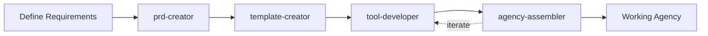

# Agency Swarm v1.0 Sub-Agent Pack

A streamlined set of Claude Code sub-agents that automate AI agency creation using the Agency Swarm v1.0.0 framework. These agents work together to build production-ready agencies from a single prompt.

## Quick Start

```bash
# 1. Copy agents to your Claude Code config
cp -r agents/ ~/.claude/agents/

# 2. Start Claude Code and use the agents
claude

# 3. Start with the PRD creator
/prd-creator
```

## The 4 Core Agents

### 🎯 prd-creator
**Purpose**: Gathers requirements and creates the Product Requirements Document

```yaml
---
name: prd-creator
description: Gathers requirements and creates the Product Requirements Document for agencies
tools: [Write, Read]
---
```

Creates a structured PRD with agency name, purpose, agents, tools, and communication flows. This is always your starting point.

### 🏗️ template-creator
**Purpose**: Scaffolds the complete agency folder structure

Creates the standard Agency Swarm v1.0 structure with proper imports, agent modules, and configuration files. Handles all the boilerplate setup.

### 🔧 tool-developer
**Purpose**: Builds production-ready tools with real implementations

Creates tools using `BaseTool` or `@function_tool` patterns. Includes API research, error handling, type safety, and test cases. No mocks or placeholders.

### 🚀 agency-assembler
**Purpose**: Completes setup, tests, and iterates

Handles three phases:
1. **Assembly** - Creates agent instructions and agency configuration
2. **Testing** - Verifies all tools and agency functionality
3. **Iteration** - Fixes issues until everything works

## Workflow



## Key Improvements

### Context Preservation
Each agent specifies what context to pass when delegating:
- Agency name and paths
- Key decisions made
- Tool requirements
- Test results

### Focused Responsibilities
- No overlap between agents
- Clear handoff points
- Single source of truth for each task

### Practical Instructions
- No boilerplate or fluff
- Direct actionable steps
- Real implementation patterns

## Example Usage

```
You: Create a marketing agency with a content writer and social media manager

/prd-creator: What specific tools should each agent have?

You: Content writer needs blog posting API, social media manager needs Twitter and LinkedIn APIs

[prd-creator creates the PRD]
[template-creator scaffolds folders]
[tool-developer implements APIs]
[agency-assembler tests and completes]

Result: Working agency in marketing_agency/ folder
```

## Tips

- **Start Simple**: Begin with 2-3 agents max
- **Test Early**: Each tool should work independently
- **Iterate Fast**: The agency-assembler will identify issues quickly
- **Keep Context**: Agents share context to avoid repetition

## Learn More

- [Agency Swarm Documentation](https://agency-swarm.ai)
- [Claude Code Sub-Agents](https://docs.anthropic.com/en/docs/claude-code/sub-agents)
- [Agency Swarm Examples](https://github.com/VRSEN/agency-swarm/tree/main/examples)
