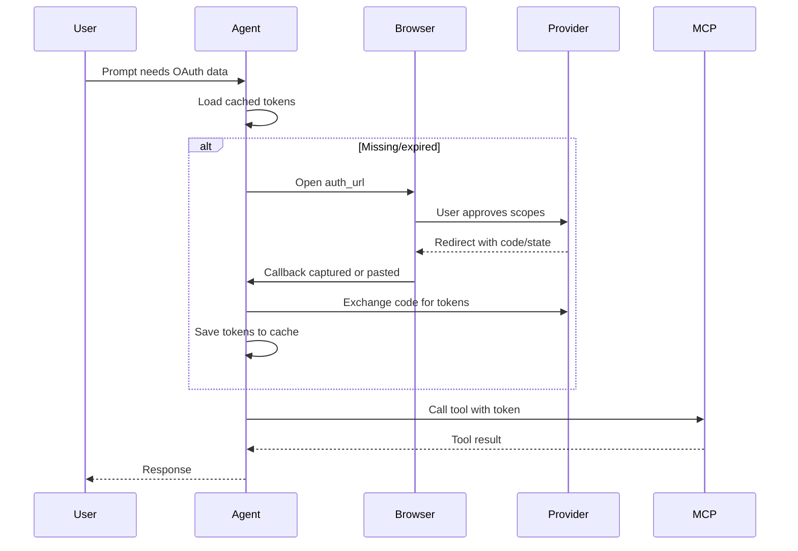

## What is this?

This feature lets **your users** connect their personal accounts to AI agents you build. When a user wants your agent to access their Gmail, GitHub, or Notion, they simply click "Authorize" in their browser—just like signing into any app. The agent then stores their credentials and can access their data on their behalf.

**Example:** You build a productivity agent. A user asks it to "summarize my unread emails." The agent prompts the user to authorize Gmail access. They click approve, and the agent can now read their inbox. Next time, it just works—no login required until the token expires.

## Why use this?

- **Users authenticate themselves** - You don't need their passwords or API keys
- **Tokens are stored per user** - Each user's credentials are isolated
- **Automatic refresh** - Tokens renew automatically; users only re-authorize when needed
- **Works with any OAuth provider** - GitHub, Google, Notion, and more

## Where OAuth is used (supported run modes)

<Tabs>
<Tab title="FastAPI (production)" defaultOpen={true}>

Use this when your agency runs on a server and users authenticate from a web/mobile UI.

- **Mode:** `saas_stream`
- **Hosted MCP** (Notion): Configure `MCPServerOAuth(url=..., name=...)` and deploy your agency.
- **Self-hosted MCP** (GitHub/Google): Run your OAuth-enabled MCP server + deploy your agency.
- **HostedMCPTool (remote MCP)**: If you use `HostedMCPTool`, OAuth tokens must be provided via `tool_config.authorization`. In FastAPI, Agency Swarm will surface the auth URL via `event: oauth_redirect` and inject the access token once authorized.
- **Streaming is required**: OAuth authorization is delivered via `event: oauth_redirect`, so use `POST /{agency}/get_response_stream`. The non-streaming `POST /{agency}/get_response` endpoint is not compatible with OAuth-enabled MCP servers.
- **Deterministic stream contract:** `meta` -> `oauth_redirect` -> `oauth_status` (`pending`) -> keepalive comments every 15s while waiting -> terminal `oauth_status` (`authorized`, `error:<reason>`, or `timeout`) -> `messages` -> `end`.
- **Bounded wait:** SaaS OAuth waits up to 10 minutes before emitting `oauth_status` = `timeout`.
- **Discovery-time auth:** with standard FastMCP auth, MCP schema discovery (`list_tools`) is protected, so OAuth can happen before the model starts generating output.
- **Per-user token isolation**: Send `X-User-Id` so each user gets their own token bucket.

See the FastAPI OAuth section: [OAuth-enabled agencies](/additional-features/fastapi-integration#oauth-enabled-agencies).

</Tab>
<Tab title="Local browser (dev/scripts)">

Use this when you are running locally (developer machine) and can open a browser.

- **Mode:** `local_browser`
- **Works with non-streaming**: `agency.get_response(...)` can open the browser and wait for the callback, then continue the run.
- **Hosted MCP** (Notion): Just the hosted MCP URL.
- **Self-hosted MCP** (GitHub/Google): Start the MCP server locally + export `*_CLIENT_ID` / `*_CLIENT_SECRET`.

</Tab>
</Tabs>

## Two types of MCP servers

**Hosted servers** (like Notion) handle OAuth for you—just connect:
```python
from agency_swarm import Agent, Agency
from agency_swarm.mcp import MCPServerOAuth

notion = MCPServerOAuth(url="https://mcp.notion.com/mcp", name="notion")

agent = Agent(name="NotionAgent", mcp_servers=[notion])
agency = Agency(agent)
agency.get_response("List my recent Notion pages")  # Local run: browser opens for authorization
```

**Self-hosted servers** (GitHub, Google) require you to run a FastMCP server with your OAuth credentials:
```bash
# Terminal 1: Start the MCP server with your OAuth app credentials
export GITHUB_CLIENT_ID="Iv1.abc123..."
export GITHUB_CLIENT_SECRET="secret123..."
python examples/mcp_oauth/github_server.py
```
```python
# Terminal 2: Connect your agent
from agency_swarm import Agent, Agency
from agency_swarm.mcp import MCPServerOAuth

github = MCPServerOAuth(url="http://localhost:8001/mcp", name="github", scopes=["repo", "user"])

agent = Agent(name="GitHubAgent", mcp_servers=[github])
agency = Agency(agent)
agency.get_response("List my repositories")  # Local run: browser opens for authorization
```

<Note>
First run opens the browser for consent. Tokens are cached under `~/.agency-swarm/mcp-tokens/` and reused automatically. Users only re-authorize when tokens expire.
</Note>

## OAuth flow at a glance



<Note>
In FastAPI mode, OAuth can happen during MCP discovery before model tokens start streaming. This is expected for OAuth-protected MCP servers.
</Note>

## Setup requirements

| Server Type | What you need |
|-------------|---------------|
| **Hosted** (Notion) | Just the server URL. OAuth is handled by the provider. |
| **Self-hosted** (GitHub, Google) | OAuth app credentials (`CLIENT_ID`, `CLIENT_SECRET`) + FastMCP server running. |

### Self-hosted: Register an OAuth app

For GitHub/Google, you need to create an OAuth app and run a FastMCP server:

1. **GitHub**: [Developer Settings](https://github.com/settings/developers) → New OAuth App
   - Callback URL: `http://localhost:8001/auth/callback`
   - Export: `GITHUB_CLIENT_ID`, `GITHUB_CLIENT_SECRET`

2. **Google**: [Cloud Console](https://console.cloud.google.com/apis/credentials) → Create Credentials → OAuth client ID
   - Callback URL: `http://localhost:8002/auth/callback`  
   - Export: `GOOGLE_CLIENT_ID`, `GOOGLE_CLIENT_SECRET`

Then run the FastMCP server (see `examples/mcp_oauth/github_server.py` for GitHub, `examples/mcp_oauth/google_server.py` for Google).

## Configuration reference

- Naming drives env vars: `name="github"` -> `GITHUB_CLIENT_ID` / `GITHUB_CLIENT_SECRET`.
- Scopes are explicit: pass only what the tool needs (e.g., `["repo", "user"]`).
- Redirects: local runs default to `http://localhost:8000/auth/callback`. For FastAPI, set `redirect_uri` (or `OAUTH_CALLBACK_URL` / `<SERVER>_REDIRECT_URI`) to your publicly reachable `/auth/callback` URL.

<ParamField param="url" type="string" required>
  MCP server endpoint (e.g., `http://localhost:8001/mcp`)
</ParamField>

<ParamField param="name" type="string" required>
  Identifier used to derive env vars (`{NAME}_CLIENT_ID`, `{NAME}_CLIENT_SECRET`)
</ParamField>

<ParamField param="scopes" type="list[string]">
  OAuth scopes to request. Defaults to `["user"]`.
</ParamField>

<ParamField param="redirect_uri" type="string">
  OAuth callback URL. Resolution order: explicit param → `{NAME}_REDIRECT_URI` env → `OAUTH_CALLBACK_URL` env → `http://localhost:8000/auth/callback`.
</ParamField>

<ParamField param="client_id" type="string">
  Override env var lookup for the client ID.
</ParamField>

<ParamField param="client_secret" type="string">
  Override env var lookup for the client secret.
</ParamField>

<ParamField param="auth_server_url" type="string">
  Set when authorization endpoints live on a different origin than the MCP endpoint.
</ParamField>

<ParamField param="cache_dir" type="Path">
  Directory for token storage. Uses `~/.agency-swarm/mcp-tokens` if not set.
</ParamField>

<ParamField param="storage" type="object">
  Custom token storage implementation. Overrides `cache_dir` when provided.
</ParamField>

<ParamField param="storage_factory" type="Callable[[str, str], object]">
  Factory function to create storage per-request for multi-tenant scenarios.
</ParamField>

<ParamField param="client_metadata" type="OAuthClientMetadata">
  Full OAuth client metadata. Overrides the auto-generated metadata from simple params.
</ParamField>

<ParamField param="redirect_handler" type="Callable[[str], Awaitable[None]]">
  Custom async handler for OAuth redirect. Receives the authorization URL to display to users. By default, opens the browser.
</ParamField>

<ParamField param="callback_handler" type="Callable[[], Awaitable[tuple[str, str | None]]]">
  Custom async handler to receive the OAuth callback code. Returns a tuple of (code, state). By default, starts a local HTTP server (or prompts for manual paste) to capture the redirect. In FastAPI deployments you typically do **not** set this—`run_fastapi` wires callback handling through `/auth/callback`.
</ParamField>

## Token storage and isolation

Tokens default to `~/.agency-swarm/mcp-tokens/{user}/{server}/`. Set `AGENCY_SWARM_MCP_CACHE_DIR` for a global override or pass `cache_dir` per server.

For per-user isolation in FastAPI, pass the `X-User-Id` header (the integration sets the OAuth user context automatically). For non-FastAPI runs, call `set_oauth_user_id()` before the run:

```python
from agency_swarm import Agency, Agent
from agency_swarm.mcp import MCPServerOAuth, set_oauth_user_id

oauth_server = MCPServerOAuth(
    url="http://localhost:8001/mcp",
    name="github",
    scopes=["repo", "user"],
)

set_oauth_user_id("user_123")

agency = Agency(
    Agent(name="GitHubAgent", mcp_servers=[oauth_server]),
    oauth_token_path="./data/oauth-tokens",
)
```

Per-user layout:
```
./data/oauth-tokens/
  default/github/tokens.json
  user_123/github/tokens.json
```
Access tokens refresh automatically via the MCP SDK; if a refresh token expires, the flow will prompt for authorization again.

## Multiple OAuth servers

```python
from agency_swarm import Agent
from agency_swarm.mcp import MCPServerOAuth

github = MCPServerOAuth(url="http://localhost:8001/mcp", name="github", scopes=["repo"])
notion = MCPServerOAuth(url="http://localhost:8002/mcp", name="notion", scopes=["read", "write"])

agent = Agent(name="MultiServiceAgent", mcp_servers=[github, notion])
```

## Advanced: Custom handlers (when you are not using FastAPI)

If you are building your own UI/server (not using `run_fastapi`), you can send the auth URL to your frontend and wait for the callback code there:

```python
from agency_swarm import Agent
from agency_swarm.mcp import MCPServerOAuth

async def send_redirect(auth_url: str) -> None:
    emit_sse("oauth_redirect", {"auth_url": auth_url})

async def wait_for_code() -> tuple[str, str | None]:
    return await poll_frontend()

# OAuth handlers are configured on MCPServerOAuth
oauth_server = MCPServerOAuth(
    url="http://localhost:8001/mcp",
    name="github",
    scopes=["repo"],
    redirect_handler=send_redirect,
    callback_handler=wait_for_code,
)

agent = Agent(name="BrowserlessAgent", mcp_servers=[oauth_server])
```

See [OAuth-enabled agencies](/additional-features/fastapi-integration#oauth-enabled-agencies) for the FastAPI production flow.

## Troubleshooting
- Browser doesn’t open or redirect fails: paste the full callback URL when prompted; confirm it matches the provider config.
- Credentials rejected: re-export `*_CLIENT_ID` and `*_CLIENT_SECRET`, then delete the cached folder for that server.
- Wrong storage path: set `AGENCY_SWARM_MCP_CACHE_DIR` or pass `cache_dir=Path(...)` to keep tokens in a specific location.

## See Also

- [FastAPI Integration](/additional-features/fastapi-integration)
- [MCP Integration](/core-framework/tools/mcp-integration)
- [MCP Specification](https://github.com/modelcontextprotocol/modelcontextprotocol)
- [FastMCP](https://gofastmcp.com/getting-started/welcome)
