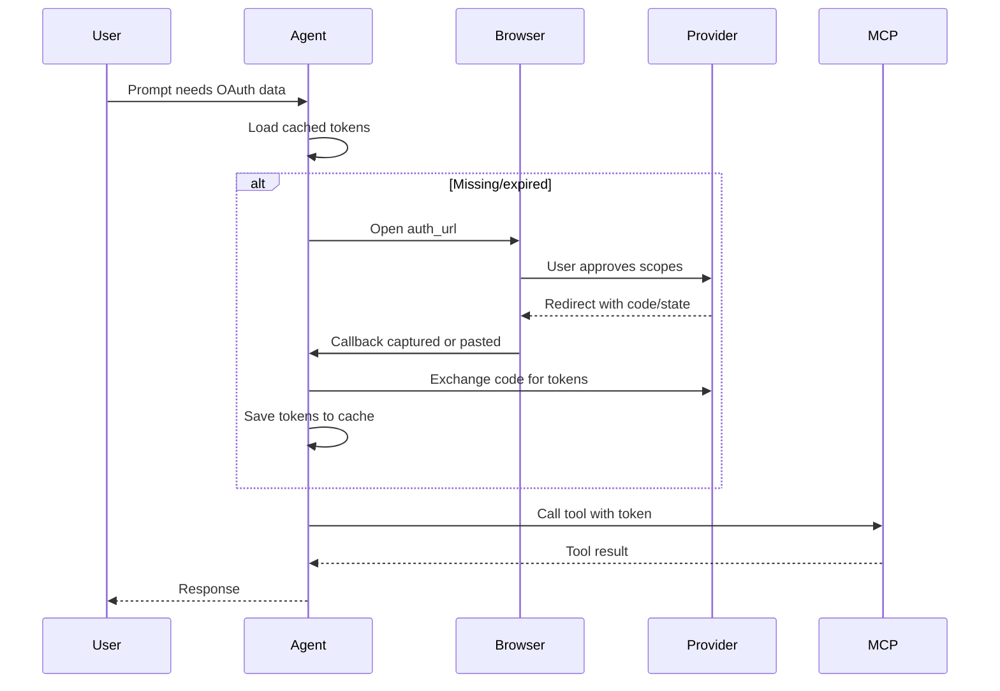

Connect OAuth-enabled MCP servers so agents can reach user-owned data (GitHub, Notion, Google Drive). This page gives a fast local setup and the few knobs you need to adjust.

## Quick start (desktop/localhost)

1) Register an OAuth app with your provider and set the redirect URI to `http://localhost:8000/auth/callback`.
2) Export your credentials:
```bash
export GITHUB_CLIENT_ID="Iv1.abc123..."
export GITHUB_CLIENT_SECRET="secret123..."
```
3) Configure the server and agent:
```python
from agency_swarm import Agent, Agency
from agency_swarm.mcp import MCPServerOAuth

github = MCPServerOAuth(
    url="http://localhost:8001/mcp",
    name="github",  # Drives env var names
    scopes=["repo", "user"],
    redirect_uri="http://localhost:8000/auth/callback",
)

agent = Agent(
    name="GitHubAgent",
    mcp_servers=[github],
)

agency = Agency([agent])
print(agency.get_response("List my GitHub repositories"))
```

<Note>
First run opens the browser for consent. Tokens are cached under `~/.agency-swarm/mcp-tokens/default/github/` and are reused automatically on later runs.
Agency Swarm spins up a tiny local callback listener for localhost redirects; if it cannot capture automatically, you can paste the callback URL in the terminal to continue.
</Note>

## OAuth flow at a glance



## What you need
- OAuth client ID/secret from your provider.
- An OAuth-capable MCP server (for example, FastMCP).
- A redirect URI reachable from where the agent runs.

## Register an OAuth app
- GitHub: Developer Settings → **New OAuth App**, set callback to `http://localhost:8000/auth/callback`, copy Client ID/Secret.
- Google: Cloud Console → Credentials → **OAuth client ID** (Desktop), set callback to `http://localhost:8000/auth/callback`, copy Client ID/Secret.
- Notion: My Integrations → **New integration**, set capabilities, copy client ID/secret.
Export each as `<NAME>_CLIENT_ID` / `<NAME>_CLIENT_SECRET`.

<Note>
OAuth client flows are implemented by the MCP Python SDK; see https://github.com/modelcontextprotocol/python-sdk for full protocol details.
</Note>

## Configuration reference

- Naming drives env vars: `name="github"` -> `GITHUB_CLIENT_ID` / `GITHUB_CLIENT_SECRET`.
- Scopes are explicit: pass only what the tool needs (e.g., `["repo", "user"]`).
- Redirects: keep `http://localhost:8000/auth/callback` for desktop; override `redirect_uri` for hosted flows.

<ParamField param="url" type="string" required>
  MCP server endpoint (e.g., `http://localhost:8001/mcp`)
</ParamField>

<ParamField param="name" type="string" required>
  Identifier used to derive env vars (`{NAME}_CLIENT_ID`, `{NAME}_CLIENT_SECRET`)
</ParamField>

<ParamField param="scopes" type="list[string]">
  OAuth scopes to request. Defaults to `["user"]`.
</ParamField>

<ParamField param="redirect_uri" type="string">
  OAuth callback URL. Resolution order: explicit param → `{NAME}_REDIRECT_URI` env → `OAUTH_CALLBACK_URL` env → `http://localhost:8000/auth/callback`.
</ParamField>

<ParamField param="client_id" type="string">
  Override env var lookup for the client ID.
</ParamField>

<ParamField param="client_secret" type="string">
  Override env var lookup for the client secret.
</ParamField>

<ParamField param="auth_server_url" type="string">
  Set when authorization endpoints live on a different origin than the MCP endpoint.
</ParamField>

<ParamField param="cache_dir" type="Path">
  Directory for token storage. Uses `~/.agency-swarm/mcp-tokens` if not set.
</ParamField>

<ParamField param="storage" type="object">
  Custom token storage implementation. Overrides `cache_dir` when provided.
</ParamField>

<ParamField param="storage_factory" type="Callable[[str, str], object]">
  Factory function to create storage per-request for multi-tenant scenarios.
</ParamField>

<ParamField param="client_metadata" type="OAuthClientMetadata">
  Full OAuth client metadata. Overrides the auto-generated metadata from simple params.
</ParamField>

## Token storage and isolation

Tokens default to `~/.agency-swarm/mcp-tokens/{user}/{server}/`. Set `AGENCY_SWARM_MCP_CACHE_DIR` for a global override or pass `cache_dir` per server. Use hooks to keep SaaS users isolated:

```python
from pathlib import Path

from agency_swarm import Agency, Agent
from agency_swarm.mcp import MCPServerOAuth, OAuthStorageHooks

oauth_server = MCPServerOAuth(
    url="http://localhost:8001/mcp",
    name="github",
    scopes=["repo", "user"],
    cache_dir=Path("./data/oauth-tokens"),
)

agency = Agency(
    [Agent(name="GitHubAgent", mcp_servers=[oauth_server])],
    hooks=[OAuthStorageHooks()],
    user_context={"user_id": "user_123"},
)
```

Per-user layout:
```
./data/oauth-tokens/
  default/github/tokens.json
  user_123/github/tokens.json
```
Access tokens refresh automatically via the MCP SDK; if a refresh token expires, the flow will prompt for authorization again.

## Multiple OAuth servers

```python
from agency_swarm import Agent
from agency_swarm.mcp import MCPServerOAuth

github = MCPServerOAuth(url="http://localhost:8001/mcp", name="github", scopes=["repo"])
notion = MCPServerOAuth(url="http://localhost:8002/mcp", name="notion", scopes=["read", "write"])

agent = Agent(name="MultiServiceAgent", mcp_servers=[github, notion])
```

## Custom handlers for web UIs

Send the auth URL to your frontend and wait for the code there:

```python
from agency_swarm import Agent
from agency_swarm.mcp import MCPServerOAuth

async def send_redirect(auth_url: str) -> None:
    emit_sse("oauth_redirect", {"auth_url": auth_url})

async def wait_for_code() -> tuple[str, str | None]:
    return await poll_frontend()

oauth_server = MCPServerOAuth(url="http://localhost:8001/mcp", name="github", scopes=["repo"])

agent = Agent(
    name="BrowserlessAgent",
    mcp_servers=[oauth_server],
    mcp_oauth_redirect_handler=send_redirect,
    mcp_oauth_callback_handler=wait_for_code,
)
```

See [MCP OAuth for Production](/platform/integrations/mcp-oauth-integration) for the full FastAPI/Docker flow.

## Troubleshooting
- Browser doesn’t open or redirect fails: paste the full callback URL when prompted; confirm it matches the provider config.
- Credentials rejected: re-export `*_CLIENT_ID` and `*_CLIENT_SECRET`, then delete the cached folder for that server.
- Wrong storage path: set `AGENCY_SWARM_MCP_CACHE_DIR` or pass `cache_dir=Path(...)` to keep tokens in a specific location.

## See Also

- [MCP OAuth for SaaS/Docker](/platform/integrations/mcp-oauth-integration)
- [MCP Integration](/core-framework/tools/mcp-integration)
- [MCP Specification](https://github.com/modelcontextprotocol/modelcontextprotocol)
- [FastMCP](https://gofastmcp.com/getting-started/welcome)
