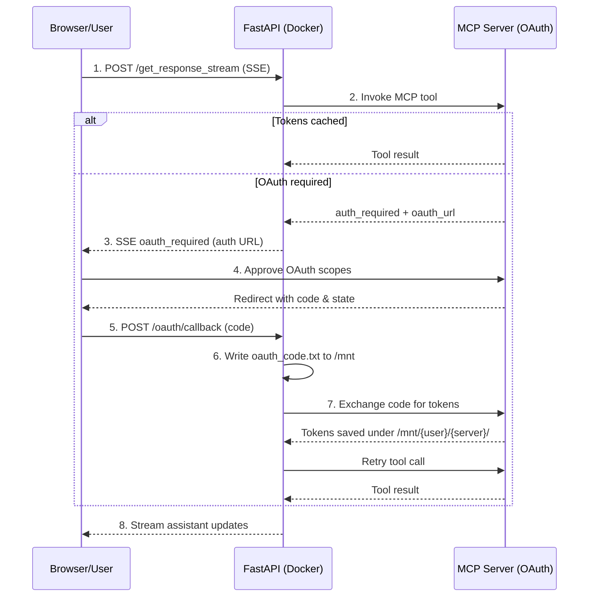

When running Agency Swarm in Docker containers or SaaS deployments (like Agencii.ai), you can't open a browser directly on the server. This guide shows how to integrate MCP OAuth with FastAPI streaming endpoints using custom handlers.

## The Challenge

**Local Development:**
- Agent opens browser directly on your machine ✅
- Callback captured automatically ✅
- Works perfectly for desktop apps

**Docker/SaaS:**
- No browser access on the server ❌
- User is accessing via web UI 🌐
- Need to send OAuth URL to frontend

## The Solution

Agency Swarm provides **custom OAuth handlers** that let you integrate the OAuth flow into your web UI. The core OAuth code stays the same—you just provide two handler functions:

1. **Redirect Handler**: Sends OAuth URL to frontend via SSE
2. **Callback Handler**: Waits for authorization code from webhook

<Note>
This follows the same pattern as [FastMCP's OAuth client](https://gofastmcp.com/clients/auth/oauth), ensuring compatibility with the MCP ecosystem.
</Note>

## Architecture

<Steps>
<Step title="1. POST /get_response_stream">
User sends a streaming request; FastAPI begins relaying SSE events back to the browser.
</Step>
<Step title="2. Tool request">
FastAPI asks the MCP server to run the selected tool. Cached tokens let the call proceed immediately.
</Step>
<Step title="3. OAuth required">
If tokens are missing or expired, the MCP server responds with an OAuth challenge and returns the authorization URL.
</Step>
<Step title="4. SSE redirect">
FastAPI emits an `oauth_required` SSE so the browser can open the OAuth popup and show the provider's consent screen.
</Step>
<Step title="5. User authorizes">
The user approves scopes. The provider redirects back to FastAPI’s `/oauth/callback` endpoint with `code` and `state`.
</Step>
<Step title="6. Code capture">
FastAPI writes `oauth_code.txt` under `/mnt/oauth-tokens/{user}/{server}/`, satisfying the waiting callback handler.
</Step>
<Step title="7. Token exchange">
FastAPI calls the MCP server again, exchanging the code for access/refresh tokens and persisting them to disk.
</Step>
<Step title="8. Resume stream">
With valid tokens stored, FastAPI retries the tool call and continues streaming assistant events to the browser.
</Step>
</Steps>



## Workflow

1. **User Initiates Request**: User sends a request to your FastAPI application (e.g., `/get_response_stream`).
2. **Agent Needs OAuth**: Agent attempts to use an MCP tool that requires OAuth.
3. **Redirect Event**: Your custom `mcp_oauth_redirect_handler` emits an SSE event (e.g., `oauth_required`) with the OAuth authorization URL.
4. **Frontend Opens OAuth**: Frontend captures the event and opens the OAuth URL in a popup/tab.
5. **User Authorizes**: User logs in and grants permissions on the OAuth provider (e.g., GitHub).
6. **OAuth Provider Redirects**: Provider redirects to your public webhook: `https://agencii.ai/oauth/callback?code=...&state=...`
7. **Webhook Writes Code**: The webhook extracts the authorization code and writes it to `/mnt/{user_id}/{server_name}/oauth_code.txt`.
8. **Container Reads Code**: The container's `mcp_oauth_callback_handler` (waiting via `asyncio.Event`) detects the file, reads the code, and returns it.
9. **MCP SDK Exchanges Code**: The MCP SDK automatically exchanges the code for access/refresh tokens (this happens inside the container).
10. **Tokens Saved**: `FileTokenStorage` automatically saves tokens to `/mnt/{user_id}/{server_name}/tokens.json`.
11. **Stream Resumes**: Agent continues transparently and the SSE stream resumes.
12. **Token Reuse**: Subsequent requests load tokens from `/mnt`, bypassing browser interaction.

<Note>
**Key Insight**: The webhook only writes the **authorization code**. Token exchange happens inside the container via the MCP SDK, following the standard OAuth flow.
</Note>

## Token Persistence

Tokens are automatically saved by `FileTokenStorage` with per-user isolation.

### Configuration

When initializing your `Agency`, provide the `oauth_token_path` parameter:

```python
from agency_swarm import Agency, Agent
from agency_swarm.mcp import MCPServerOAuth

# Example: Configure for persistent storage in Docker
agency = Agency(
    Agent(...),
    oauth_token_path="/mnt/oauth-tokens",  # Tokens stored here, isolated by user_id
    user_context={"user_id": user_id}      # Pass user_id from request header
)
```

<Note>
If you skip `oauth_token_path`, Agency falls back to `~/.agency-swarm/mcp-tokens` (or `$AGENCY_SWARM_MCP_CACHE_DIR` when set). Override it when you need a mounted volume or per-environment cache location.
</Note>

### Storage Structure

```
/mnt/oauth-tokens/
    {user_id}/
        github/
            tokens.json          # Access & refresh tokens
            client.json          # Client metadata
            oauth_code.txt       # Temporary: auth code from webhook
    {another_user_id}/
        github/
            tokens.json
```

This ensures:
- **Per-user isolation**: Each user's tokens are separate.
- **Persistence**: Tokens survive container restarts (if `/mnt` is a mounted volume).
- **Flexibility**: Works with any OAuth-enabled MCP server.

## FastAPI OAuth (automatic)

`run_fastapi` now detects `MCPServerOAuth` servers automatically and wires the OAuth flow for you—no custom handlers or manual `StreamingResponse` wiring required.

- `/oauth/callback` and `/oauth/status/{state}` are created automatically when any agency contains an OAuth-enabled MCP server.
- Streaming endpoints emit `event: oauth_redirect` with `{state, server, auth_url}` when a user must authorize. Your frontend should open `auth_url`, then poll `/oauth/status/{state}` until `status: authorized`.
- The callback will receive the provider redirect and wake the in-flight request. Tokens are stored per user when you pass `X-User-Id`.

```python
from agency_swarm import Agent, Agency, run_fastapi
from agency_swarm.mcp import MCPServerOAuth

oauth_server = MCPServerOAuth(
    url="http://localhost:8001/mcp",
    name="github",
    scopes=["repo", "user"],
)

def create_agency(load_threads_callback=None):
    return Agency(
        Agent(
            name="GitHubAgent",
            mcp_servers=[oauth_server],
        ),
        oauth_token_path="/mnt/oauth-tokens",
    )

run_fastapi(
    agencies={"github": create_agency},
)
```

UI flow:
- Start streaming via `POST /github/get_response_stream` with `X-User-Id` to isolate tokens.
- Listen for `event: oauth_redirect` and open `auth_url` in the browser.
- The provider redirects to `/oauth/callback?code=...&state=...`; poll `/oauth/status/{state}` until it returns `status: authorized`, then continue consuming the stream.

<Note>
Set `redirect_uri` on `MCPServerOAuth` to the publicly reachable URL that forwards to this service’s `/oauth/callback` route (e.g., your ingress hostname plus `/oauth/callback`). You can also set `OAUTH_CALLBACK_URL` or `<SERVER>_REDIRECT_URI` as a fallback. The localhost default is only for development; production deployments must expose that path and route it back to the issuing pod (sticky routing or shared state) or the flow will time out.
</Note>

<Warning>
The OAuth state registry lives in-process. Use a single replica or enforce sticky routing to the same pod during the OAuth flow, or back the state registry with a shared store before load-balancing.
</Warning>

## Environment Variables

```bash
# OAuth credentials (shared across all users)
GITHUB_CLIENT_ID=your_client_id
GITHUB_CLIENT_SECRET=your_client_secret
OAUTH_CALLBACK_URL=https://your-ingress.example.com/oauth/callback  # optional global fallback
```

## Docker Setup

Mount `/mnt` as a persistent volume:

```yaml
version: '3.8'
services:
  agency-swarm:
    image: your-app:latest
    environment:
      - GITHUB_CLIENT_ID=${GITHUB_CLIENT_ID}
      - GITHUB_CLIENT_SECRET=${GITHUB_CLIENT_SECRET}
    volumes:
      - oauth-tokens:/mnt/oauth-tokens  # Persistent volume
    ports:
      - "8000:8000"

volumes:
  oauth-tokens:
```

## Security

<Warning>
**Production Checklist:**
- Use HTTPS for OAuth callbacks
- Validate OAuth state parameter to prevent CSRF
- File permissions: `0o600` for tokens/codes, `0o700` for directories
- Set appropriate access controls on `/mnt` volume
- Never log or expose OAuth tokens or codes
- Use Redis/DB for state management in multi-container setups
</Warning>

## See Also

- [MCP OAuth for Local Development](/core-framework/tools/mcp-oauth)
- [FastAPI Integration](/additional-features/fastapi-integration)
- [FastMCP OAuth Documentation](https://gofastmcp.com/clients/auth/oauth)
- [MCP Protocol Specification](https://github.com/modelcontextprotocol/modelcontextprotocol)
