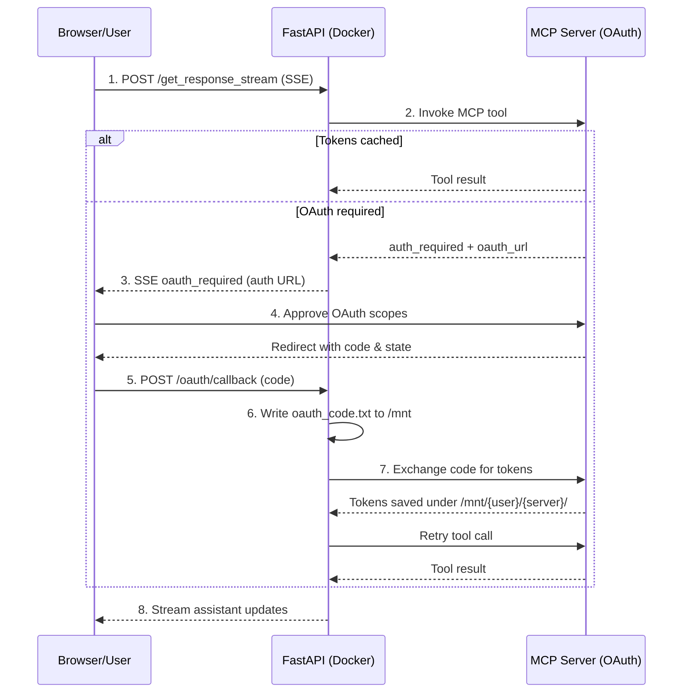

When running Agency Swarm in Docker containers or SaaS deployments (like Agencii.ai), you can't open a browser directly on the server. This guide shows how to integrate MCP OAuth with FastAPI streaming endpoints using custom handlers.

## The Challenge

**Local Development:**
- Agent opens browser directly on your machine ✅
- Callback captured automatically ✅
- Works perfectly for desktop apps

**Docker/SaaS:**
- No browser access on the server ❌
- User is accessing via web UI 🌐
- Need to send OAuth URL to frontend

## The Solution

Agency Swarm provides **custom OAuth handlers** that let you integrate the OAuth flow into your web UI. The core OAuth code stays the same—you just provide two handler functions:

1. **Redirect Handler**: Sends OAuth URL to frontend via SSE
2. **Callback Handler**: Waits for authorization code from webhook

<Note>
This follows the same pattern as [FastMCP's OAuth client](https://gofastmcp.com/clients/auth/oauth), ensuring compatibility with the MCP ecosystem.
</Note>

## Architecture

<Steps>
<Step title="1. POST /get_response_stream">
User sends a streaming request; FastAPI begins relaying SSE events back to the browser.
</Step>
<Step title="2. Tool request">
FastAPI asks the MCP server to run the selected tool. Cached tokens let the call proceed immediately.
</Step>
<Step title="3. OAuth required">
If tokens are missing or expired, the MCP server responds with an OAuth challenge and returns the authorization URL.
</Step>
<Step title="4. SSE redirect">
FastAPI emits an `oauth_required` SSE so the browser can open the OAuth popup and show the provider's consent screen.
</Step>
<Step title="5. User authorizes">
The user approves scopes. The provider redirects back to FastAPI’s `/oauth/callback` endpoint with `code` and `state`.
</Step>
<Step title="6. Code capture">
FastAPI writes `oauth_code.txt` under `/mnt/oauth-tokens/{user}/{server}/`, satisfying the waiting callback handler.
</Step>
<Step title="7. Token exchange">
FastAPI calls the MCP server again, exchanging the code for access/refresh tokens and persisting them to disk.
</Step>
<Step title="8. Resume stream">
With valid tokens stored, FastAPI retries the tool call and continues streaming assistant events to the browser.
</Step>
</Steps>



## Workflow

1. **User Initiates Request**: User sends a request to your FastAPI application (e.g., `/get_response_stream`).
2. **Agent Needs OAuth**: Agent attempts to use an MCP tool that requires OAuth.
3. **Redirect Event**: Your custom `mcp_oauth_redirect_handler` emits an SSE event (e.g., `oauth_required`) with the OAuth authorization URL.
4. **Frontend Opens OAuth**: Frontend captures the event and opens the OAuth URL in a popup/tab.
5. **User Authorizes**: User logs in and grants permissions on the OAuth provider (e.g., GitHub).
6. **OAuth Provider Redirects**: Provider redirects to your public webhook: `https://agencii.ai/oauth/callback?code=...&state=...`
7. **Webhook Writes Code**: The webhook extracts the authorization code and writes it to `/mnt/{user_id}/{server_name}/oauth_code.txt`.
8. **Container Reads Code**: The container's `mcp_oauth_callback_handler` (waiting via `asyncio.Event`) detects the file, reads the code, and returns it.
9. **MCP SDK Exchanges Code**: The MCP SDK automatically exchanges the code for access/refresh tokens (this happens inside the container).
10. **Tokens Saved**: `FileTokenStorage` automatically saves tokens to `/mnt/{user_id}/{server_name}/tokens.json`.
11. **Stream Resumes**: Agent continues transparently and the SSE stream resumes.
12. **Token Reuse**: Subsequent requests load tokens from `/mnt`, bypassing browser interaction.

<Note>
**Key Insight**: The webhook only writes the **authorization code**. Token exchange happens inside the container via the MCP SDK, following the standard OAuth flow.
</Note>

## Token Persistence

Tokens are automatically saved by `FileTokenStorage` with per-user isolation.

### Configuration

When initializing your `Agency`, provide the `oauth_token_path` parameter:

```python
from agency_swarm import Agency, Agent
from agency_swarm.mcp import MCPServerOAuth

# Example: Configure for persistent storage in Docker
agency = Agency(
    Agent(...),
    oauth_token_path="/mnt/oauth-tokens",  # Tokens stored here, isolated by user_id
    user_context={"user_id": user_id}      # Pass user_id from request header
)
```

### Storage Structure

```
/mnt/oauth-tokens/
    {user_id}/
        github/
            tokens.json          # Access & refresh tokens
            client.json          # Client metadata
            oauth_code.txt       # Temporary: auth code from webhook
    {another_user_id}/
        github/
            tokens.json
```

This ensures:
- **Per-user isolation**: Each user's tokens are separate.
- **Persistence**: Tokens survive container restarts (if `/mnt` is a mounted volume).
- **Flexibility**: Works with any OAuth-enabled MCP server.

## Custom OAuth Handlers

For FastAPI/SSE integration, you need custom handlers to pause/resume the stream.

### Example Implementation

```python
import asyncio
from collections import defaultdict
from pathlib import Path
from typing import Any

from fastapi import FastAPI, Header
from agency_swarm import Agency, Agent
from agency_swarm.mcp import MCPServerOAuth

app = FastAPI()

# Store asyncio.Event objects per request_id
_oauth_events: dict[str, asyncio.Event] = {}
_oauth_urls: dict[str, str] = {}

async def custom_redirect_handler(auth_url: str) -> None:
    """Emit SSE event with OAuth URL to frontend."""
    # In real implementation, you'd emit this via your SSE stream
    # For example:
    # await sse_queue.put({"event": "oauth_required", "data": {"url": auth_url}})
    
    # Store URL for this request
    request_id = get_current_request_id()  # Get from contextvars
    _oauth_urls[request_id] = auth_url
    print(f"OAuth URL for request {request_id}: {auth_url}")

async def custom_callback_handler() -> tuple[str, str | None]:
    """Wait for authorization code from webhook, then return it."""
    request_id = get_current_request_id()  # Get from contextvars
    user_id = get_current_user_id()        # Get from contextvars
    server_name = "github"  # You'd get this from context too
    
    # Create event for this request
    event = asyncio.Event()
    _oauth_events[request_id] = event
    
    # Wait for webhook to write the code file
    code_file = Path(f"/mnt/oauth-tokens/{user_id}/{server_name}/oauth_code.txt")
    
    # Wait for the event to be set by webhook
    await event.wait()
    
    # Read the code
    if code_file.exists():
        code_data = code_file.read_text().strip()
        code_file.unlink()  # Delete after reading
        
        # Parse code and state (format: "code=...&state=...")
        parts = dict(param.split("=") for param in code_data.split("&"))
        return parts.get("code", ""), parts.get("state")
    
    raise ValueError("Authorization code file not found")

@app.post("/oauth/callback")
async def oauth_callback(code: str, state: str, user_id: str = Header(..., alias="X-User-Id")):
    """Webhook endpoint: receives OAuth callback and writes code to /mnt."""
    # Determine which server this is for (from state parameter)
    server_name = parse_server_from_state(state)  # Your implementation
    
    # Write code to persistent volume
    code_dir = Path(f"/mnt/oauth-tokens/{user_id}/{server_name}")
    code_dir.mkdir(parents=True, exist_ok=True)
    
    code_file = code_dir / "oauth_code.txt"
    code_file.write_text(f"code={code}&state={state}")
    
    # Signal the waiting callback_handler
    request_id = extract_request_id_from_state(state)  # Your implementation
    if request_id in _oauth_events:
        _oauth_events[request_id].set()
    
    return {"status": "ok"}

@app.post("/get_response_stream")
async def chat_stream(message: str, user_id: str = Header(..., alias="X-User-Id")):
    """Chat endpoint with OAuth support."""
    oauth_server = MCPServerOAuth(
        url="http://localhost:8001/mcp",
        name="github",
        scopes=["repo", "user"]
    )
    
    agent = Agent(
        name="GitHubAgent",
        mcp_servers=[oauth_server],
        mcp_oauth_redirect_handler=custom_redirect_handler,
        mcp_oauth_callback_handler=custom_callback_handler,
    )
    
    agency = Agency(
        [agent],
        oauth_token_path="/mnt/oauth-tokens",
        user_context={"user_id": user_id}
    )
    
    response = await agency.get_response(message)
    return response
```

<Note>
**Production Note**: The example above is simplified. In production, you'd use proper context management (contextvars), store state in Redis/DB for multi-container deployments, and handle timeouts/errors robustly.
</Note>

## Environment Variables

```bash
# OAuth credentials (shared across all users)
GITHUB_CLIENT_ID=your_client_id
GITHUB_CLIENT_SECRET=your_client_secret

# Your public callback URL (points to webhook)
OAUTH_CALLBACK_URL=https://agencii.ai/oauth/callback
```

## Docker Setup

Mount `/mnt` as a persistent volume:

```yaml
version: '3.8'
services:
  agency-swarm:
    image: your-app:latest
    environment:
      - GITHUB_CLIENT_ID=${GITHUB_CLIENT_ID}
      - GITHUB_CLIENT_SECRET=${GITHUB_CLIENT_SECRET}
      - OAUTH_CALLBACK_URL=https://agencii.ai/oauth/callback
    volumes:
      - oauth-tokens:/mnt/oauth-tokens  # Persistent volume
    ports:
      - "8000:8000"

volumes:
  oauth-tokens:
```

## Security

<Warning>
**Production Checklist:**
- Use HTTPS for OAuth callbacks
- Validate OAuth state parameter to prevent CSRF
- File permissions: `0o600` for tokens/codes, `0o700` for directories
- Set appropriate access controls on `/mnt` volume
- Never log or expose OAuth tokens or codes
- Use Redis/DB for state management in multi-container setups
</Warning>

## See Also

- [MCP OAuth for Local Development](/core-framework/tools/mcp-oauth)
- [FastAPI Integration](/additional-features/fastapi-integration)
- [FastMCP OAuth Documentation](https://gofastmcp.com/clients/auth/oauth)
- [MCP Protocol Specification](https://github.com/modelcontextprotocol/modelcontextprotocol)
