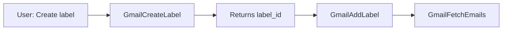

# GmailCreateLabel - Quick Reference

## One-Line Summary
Create custom Gmail labels (folders/tags) for organizing emails.

## Import
```python
from email_specialist.tools.GmailCreateLabel import GmailCreateLabel
```

## Basic Usage
```python
# Create basic label
tool = GmailCreateLabel(name="Clients")
result = tool.run()

# Returns:
# {
#   "success": true,
#   "label_id": "Label_123456789",
#   "name": "Clients",
#   "label_list_visibility": "labelShow",
#   "message_list_visibility": "show"
# }
```

## Parameters

| Parameter | Type | Required | Default | Description |
|-----------|------|----------|---------|-------------|
| name | str | ✅ Yes | - | Label name (e.g., "Clients", "Work/ProjectA") |
| label_list_visibility | str | No | "labelShow" | "labelShow" or "labelHide" |
| message_list_visibility | str | No | "show" | "show" or "hide" |

## Common Patterns

### Standard Label (Visible, Inbox)
```python
GmailCreateLabel(name="Clients")
```

### Auto-Archive Label (Visible, Skip Inbox)
```python
GmailCreateLabel(
    name="Newsletters",
    message_list_visibility="hide"
)
```

### Hidden Label (Hidden, Skip Inbox)
```python
GmailCreateLabel(
    name="Archive",
    label_list_visibility="labelHide",
    message_list_visibility="hide"
)
```

### Hierarchical Label
```python
GmailCreateLabel(name="Work/ProjectA")
```

## Voice Commands

| User Says | CEO Routes To |
|-----------|---------------|
| "Create a label for Clients" | `GmailCreateLabel(name="Clients")` |
| "Add an Invoices label" | `GmailCreateLabel(name="Invoices")` |
| "Make a Work/ProjectA label" | `GmailCreateLabel(name="Work/ProjectA")` |

## Integration Flow



## Next Steps After Creating

1. **Add to messages**:
   ```python
   GmailAddLabel(message_id="msg_123", label_ids=[label_id])
   ```

2. **Search by label**:
   ```python
   GmailFetchEmails(query="label:Clients")
   ```

3. **List all labels**:
   ```python
   GmailListLabels()
   ```

## Validation

✅ **Checks**:
- Empty name → Error
- Invalid visibility → Error
- Missing credentials → Error
- Duplicate label → Helpful error

## Response Structure

```python
{
    "success": bool,          # Operation status
    "label_id": str | None,   # Use with GmailAddLabel
    "name": str,              # Label display name
    "label_list_visibility": str,  # Sidebar visibility
    "message_list_visibility": str, # Message visibility
    "type": str,              # Always "user" for custom
    "message": str,           # Success/error message
    "usage": dict             # Integration hints (on success)
}
```

## Error Handling

```python
result = json.loads(tool.run())

if result["success"]:
    label_id = result["label_id"]
    # Use label_id with other tools
else:
    error = result["error"]
    # Handle error (duplicate, invalid params, etc.)
```

## Testing

```bash
# Quick validation test (no API)
cd email_specialist/tools
python test_create_label_simple.py

# Comprehensive test (requires API credentials)
python test_gmail_create_label.py
```

## Files

- **Tool**: `GmailCreateLabel.py` (286 lines)
- **Tests**: `test_gmail_create_label.py`, `test_create_label_simple.py`
- **Docs**: `GmailCreateLabel_README.md`
- **Report**: `GMAIL_CREATE_LABEL_IMPLEMENTATION_REPORT.md`

## Status
✅ Production Ready | ✅ Validated Pattern | ✅ Tests Passing

---
**Tool #16 of 24** | **Phase 3** | **Created**: Nov 1, 2025
